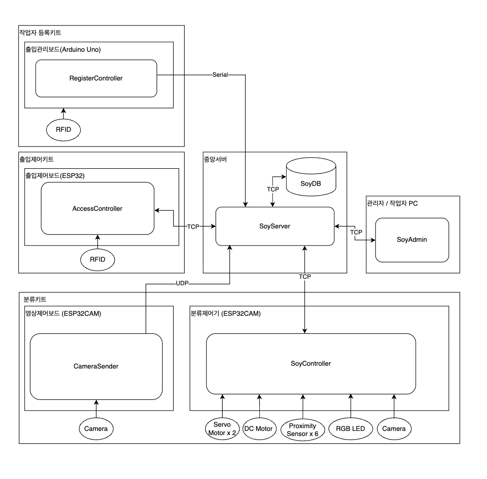

# Smart Soy Sauce Factory (스마트 간장공장)

주소지를 기준으로 해외/국내로 제품을 분류하는 스마트 간장공장 소프트웨어

## 개요

컨베이어 벨트 위의 제품 상자에 부착된 QR 코드를 ESP32cam 분류제어기로 읽어, 주소 정보를 파악한 뒤 서보모터를 조작해 제품을 국내/해외 창고로 자동 분류합니다.

## 시스템 아키텍처



## 구성 요소

| 구성요소 | 기술 스택 | 설명 |
|----------|-----------|------|
| **SoyDB** | MySQL (Docker) | 제품·주소·출입·분류 등 전체 데이터 저장 |
| **중앙서버 (SoyServer)** | Python, FastAPI, Alembic | 출입제어·분류·관리자 PC와 통신, DB 연동, 스키마 마이그레이션 |
| **관리자/작업자 PC (SoyAdmin)** | PyQt | 모니터링 및 운영 UI |
| **작업자 등록키트** | Arduino (Uno) | RFID로 작업자 등록, RegisterController, 중앙서버와 Serial 통신 |
| **출입제어키트** | Arduino (ESP32) | RFID 기반 출입 제어, 중앙서버와 TCP 통신 |
| **분류키트** | Arduino (ESP32CAM) | QR 코드 인식, 근접센서·서보·DC모터 제어, 중앙서버와 TCP/UDP 통신 |

## 폴더 구조

```
soy-factory/
├── soy-server/        # FastAPI 중앙서버
├── soy-pc/            # PyQt 관리자/작업자 UI
├── soy-db/            # MySQL 스키마·Docker 설정
├── register-controller/ # 작업자 등록키트 (Arduino Uno + RFID)
├── soy-controller/    # 분류키트 (Arduino/ESP32CAM)
├── access-controller/ # 출입제어 (Arduino/ESP32)
└── README.md
```

## 요구 사항

- Python 3.12
- **uv** (가상환경·패키지 관리용, [설치](https://docs.astral.sh/uv/getting-started/installation/))
- Docker (MySQL)
- Arduino/ESP32 개발 환경 (출입제어·분류키트 빌드용)

## 1. 프로젝트 세팅

리포 클론 후, 루트에서 **uv**로 가상환경을 만들고 의존성을 설치합니다.

```bash
cd soy-factory
uv venv
source .venv/bin/activate   # Windows: .venv\Scripts\activate
uv sync
```

- Python 3.12, [uv 설치](https://docs.astral.sh/uv/getting-started/installation/) 필요.
- 서버·soy-pc 등 Python 의존성은 루트 `pyproject.toml`에서 관리됩니다.

## 2. 개발 방법

### register-controller / access-controller / soy-controller (펌웨어)

- **작업자 등록키트** (`register-controller/`): Arduino Uno + RFID, RegisterController 펌웨어. 중앙서버와 Serial 통신.
- **VSCode**에 **PlatformIO IDE** 확장을 설치한 뒤, 각 폴더(`register-controller/`, `access-controller/`, `soy-controller/`)를 열어 빌드·업로드합니다.

### 서버·DB (SoyServer + MySQL)

- 루트에서 Docker Compose로 한 번에 띄웁니다.

```bash
docker compose up -d
```

- **MySQL**: `localhost:3333` (사용자 `soy` / 비밀번호 `soy`, DB `soydb`)
- **SoyServer HTTP**: http://localhost:8000 (health, API 문서: http://localhost:8000/docs) — 기동 시 DB 마이그레이션 자동 적용
- **SoyServer TCP**: `localhost:9001` — Soy-PC(관리자 UI)가 Worker CRUD·card_read 푸시에 사용. **soy-pc 실행 전에 서버가 떠 있어야 함.**
- **Adminer** (DB 스키마 조회): http://localhost:8080 — 자동 로그인(soydb), 로컬/내부용만 사용 권장
- 로컬에서 마이그레이션만 수동 실행: `cd soy-server && uv run alembic upgrade head` (상세는 [soy-db/README.md](soy-db/README.md) 참고)

### soy-pc (관리자 UI)

- **UI 수정**: `designer.py`로 Qt Designer를 띄워 `soy-pc/ui/` 폴더의 `.ui` 파일(메인: `main_window.ui`, 화면별: `lock_screen.ui`, `worker_screen.ui`, `admin_screen.ui`, `password_dialog.ui`)을 편집합니다. (Qt 설치 필요. macOS: `brew install qt`)
- **실행**: `soy_pc.py`로 SoyAdmin 앱을 실행합니다. **Connection refused (61)** 가 나오면 SoyServer가 먼저 떠 있는지 확인하세요 (Docker: `docker compose up -d` 또는 로컬: `uv run uvicorn app.main:app --app-dir soy-server --host 127.0.0.1 --port 8000`). soy-pc는 TCP 포트 **9001**로 접속합니다.

```bash
uv run python designer.py    # UI 편집
uv run python soy_pc.py     # 앱 실행 (서버 선 기동 필요)
```

### RFID(작업자 등록키트) 사용 시 — 맥

**Docker Desktop for Mac**에서는 호스트 시리얼 장치(`/dev/cu.usbmodem*`)를 컨테이너에 넘길 수 없습니다. RFID를 쓰려면 **MySQL만 Docker로 띄우고, SoyServer는 맥에서 직접 실행**하세요.

1. **MySQL만 기동** (soy-server는 띄우지 않음)

   ```bash
   docker compose up -d mysql
   ```

   (또는 `docker compose up -d` 후 soy-server 컨테이너만 중지해도 됨.)

2. **아두이노 USB 연결** 후 시리얼 포트 확인: `ls /dev/cu.usb*` (예: `/dev/cu.usbmodem21101`)

3. **SoyServer를 로컬에서 실행** (DB는 Docker MySQL에 연결)

   ```bash
   MYSQL_HOST=127.0.0.1 MYSQL_PORT=3333 MYSQL_USER=soy MYSQL_PASSWORD=soy MYSQL_DATABASE=soydb \
   SOY_REGISTER_SERIAL_PORT=/dev/cu.usbmodem21101 \
   uv run uvicorn app.main:app --app-dir soy-server --host 127.0.0.1 --port 8000
   ```

   포트는 2번에서 확인한 값으로 바꾸세요. 이렇게 하면 시리얼(RFID)과 TCP(soy-pc)가 모두 동작합니다.

