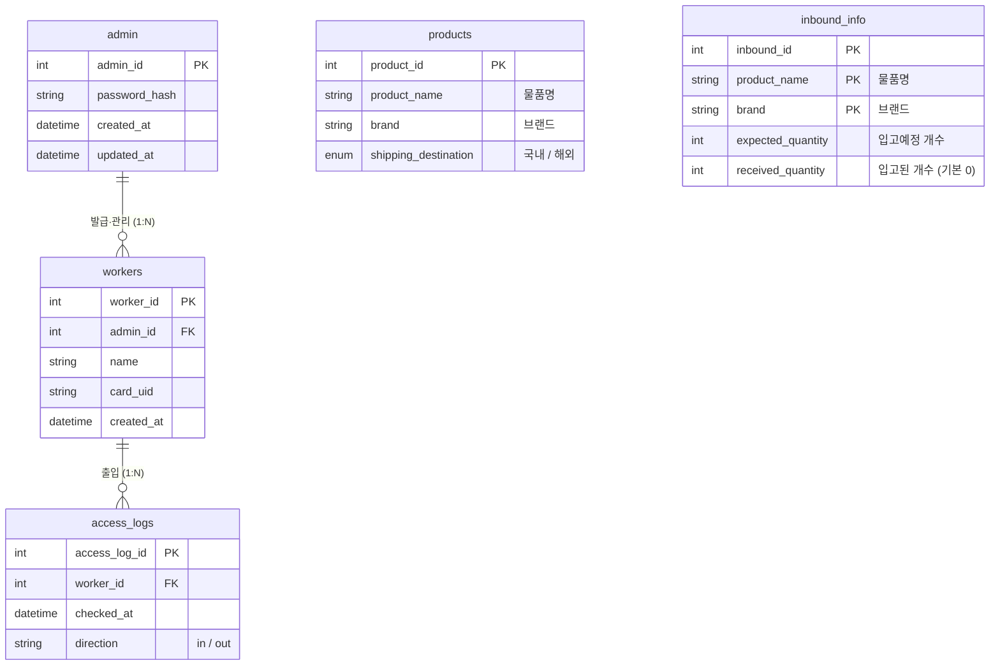

# ER Diagram — Smart Soy Sauce Factory

SYSTEM_REQUIREMENTS.md 기반 DB 스키마 개념 설계.  
아래 Mermaid 코드는 GitHub/GitLab, Cursor, VS Code 등에서 렌더링 가능하다.

---

---

## 엔티티 요약

| 엔티티 | 요구사항 | 설명 |
|--------|----------|------|
| **admin** | S-01 | 관리자(admin_id, 비밀번호 해시) |
| **workers** | S-02, S-03 | 작업자(worker_id, 발급 관리자, 이름, 카드 UID) |
| **access_logs** | S-04 | 작업자별 출입 로그(시각, 출입 방향) |
| **products** | — | 물품(물품명, 브랜드, 배송지) |
| **inbound_info** | S-08 | 입고정보(입고 id + 물품명 + 브랜드 복합키, 입고예정 개수, 입고된 개수) |

나머지 테이블(분류 공정, 로그 등)은 추후 반영 예정.
