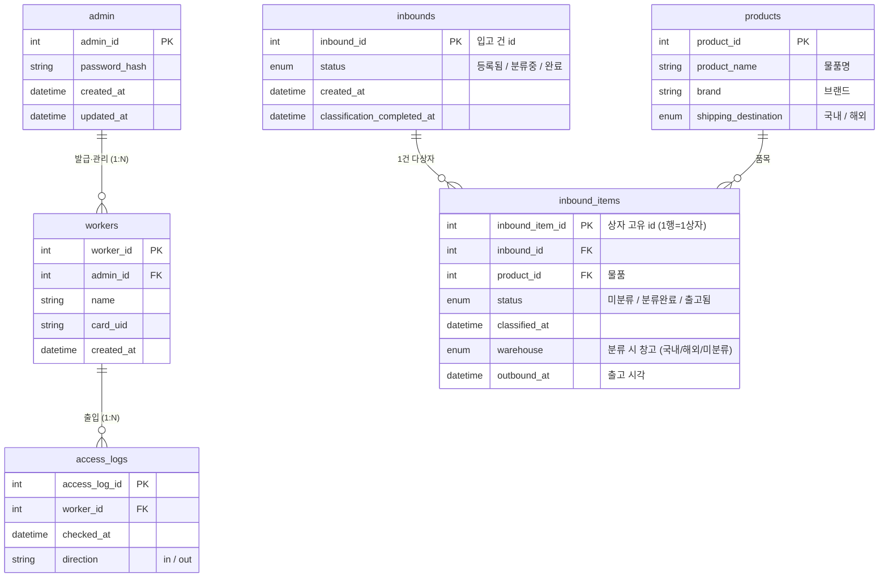

# ER Diagram — Smart Soy Sauce Factory

SYSTEM_REQUIREMENTS.md 기반 DB 스키마 개념 설계.  
- **ER 다이어그램**: 엔티티·관계 개요 (Mermaid). GitHub/GitLab, Cursor, VS Code 등에서 렌더링 가능.  
- **테이블 스키마 요약**: 실제 마이그레이션(001~004)과 일치하는 컬럼 정의. 코드/API 작성 시 이 문서와 마이그레이션을 기준으로 한다.

## 요구사항 → 테이블 매핑

| 요구 | 설명 | 사용 테이블·컬럼 |
|------|------|------------------|
| **1. QR로 물품 등록** | 입고 종이 QR 스캔 시 목록 저장 | `inbounds` 1행 + `inbound_items` 상자별 행 (1행=1상자, inbound_item_id만 PK) |
| **2. 등록한 물품 분류 여부** | 품목별로 분류됐는지·출고됐는지·언제·어느 창고로 | `inbound_items.status`(미분류/분류완료/출고됨), `classified_at`, `warehouse`, `outbound_at` |
| **3. 창고 현황** | 창고(국내/해외/미분류)별 현재 재고 수량 | `inbound_items` 에서 status='분류완료' 인 행을 product_id·warehouse 별 COUNT |

---

---

## 엔티티 요약

| 엔티티 | 요구사항 | 설명 |
|--------|----------|------|
| **admin** | S-01 | 관리자(admin_id, 비밀번호 해시) |
| **workers** | S-02, S-03 | 작업자(worker_id, 발급 관리자, 이름, 카드 UID) |
| **access_logs** | S-04 | 작업자별 출입 로그(시각, 출입 방향) |
| **products** | — | 물품(물품명, 브랜드, 배송지) |
| **inbounds** | 요구 1 | 입고 건(QR 1건). QR 스캔 시 1행 생성. 상태: 등록됨 → 분류중 → 완료 |
| **inbound_items** | 요구 2·3 | 입고 건별 상자(1행=1상자). status: 미분류→분류완료→출고됨. 분류 시 warehouse·classified_at, 출고 시 outbound_at. 창고 현황은 status='분류완료' 집계 |

---

## 테이블 스키마 요약 (마이그레이션 001~004 기준)

아래는 실제 DB 테이블 정의와 동일하게 정리한 스키마이다. PK, FK, 인덱스는 마이그레이션과 일치한다.

### admin
| 컬럼 | 타입 | 비고 |
|------|------|------|
| admin_id | INT UNSIGNED | PK, AUTO_INCREMENT |
| password_hash | VARCHAR(255) | NOT NULL |
| created_at | DATETIME | DEFAULT CURRENT_TIMESTAMP |
| updated_at | DATETIME | ON UPDATE CURRENT_TIMESTAMP |

### workers
| 컬럼 | 타입 | 비고 |
|------|------|------|
| worker_id | INT UNSIGNED | PK, AUTO_INCREMENT |
| admin_id | INT UNSIGNED | FK → admin, NOT NULL |
| name | VARCHAR(100) | NOT NULL |
| card_uid | VARCHAR(64) | NOT NULL, UNIQUE (RFID 카드 UID) |
| created_at | DATETIME | DEFAULT CURRENT_TIMESTAMP |

### access_logs
| 컬럼 | 타입 | 비고 |
|------|------|------|
| access_log_id | INT UNSIGNED | PK, AUTO_INCREMENT |
| worker_id | INT UNSIGNED | FK → workers, NOT NULL |
| checked_at | DATETIME | NOT NULL |
| direction | VARCHAR(10) | NOT NULL (in / out) |

### products
| 컬럼 | 타입 | 비고 |
|------|------|------|
| product_id | INT UNSIGNED | PK, AUTO_INCREMENT |
| product_name | VARCHAR(100) | NOT NULL (물품명) |
| brand | VARCHAR(50) | NOT NULL (브랜드) |
| shipping_destination | ENUM('국내','해외') | NOT NULL (배송지) |

### inbounds
| 컬럼 | 타입 | 비고 |
|------|------|------|
| inbound_id | INT UNSIGNED | PK (**앱/QR에서 부여**, AUTO_INCREMENT 아님) |
| status | ENUM('등록됨','분류중','완료') | NOT NULL, DEFAULT '등록됨' |
| created_at | DATETIME | DEFAULT CURRENT_TIMESTAMP |
| classification_completed_at | DATETIME | NULL (분류 완료 시각) |

### inbound_items
| 컬럼 | 타입 | 비고 |
|------|------|------|
| inbound_item_id | INT UNSIGNED | PK, AUTO_INCREMENT (1행 = 1상자) |
| inbound_id | INT UNSIGNED | FK → inbounds, NOT NULL |
| product_id | INT UNSIGNED | FK → products, NOT NULL |
| status | ENUM('미분류','분류완료','출고됨') | NOT NULL, DEFAULT '미분류' |
| classified_at | DATETIME | NULL (분류 완료 시각) |
| warehouse | ENUM('국내','해외','미분류') | NULL (분류/출고 시 목적 창고) |
| outbound_at | DATETIME | NULL (출고 시각, 출고됨 시) |

---

나머지 테이블(분류 공정, 로그 등)은 추후 반영 예정.
